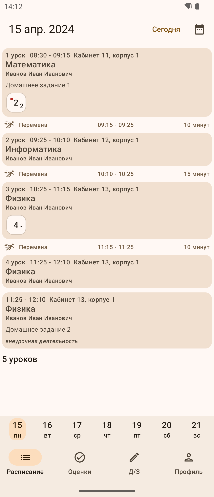
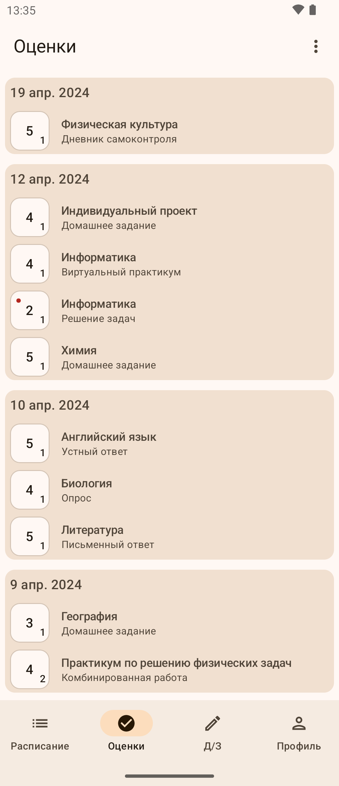
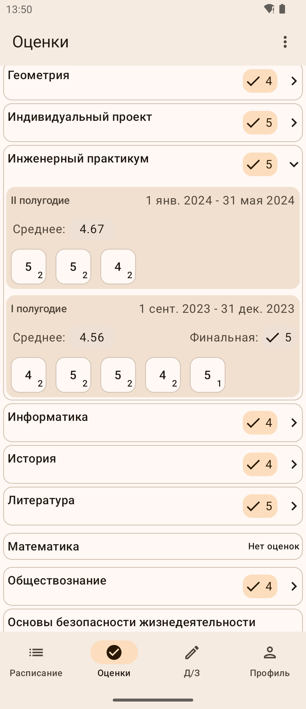
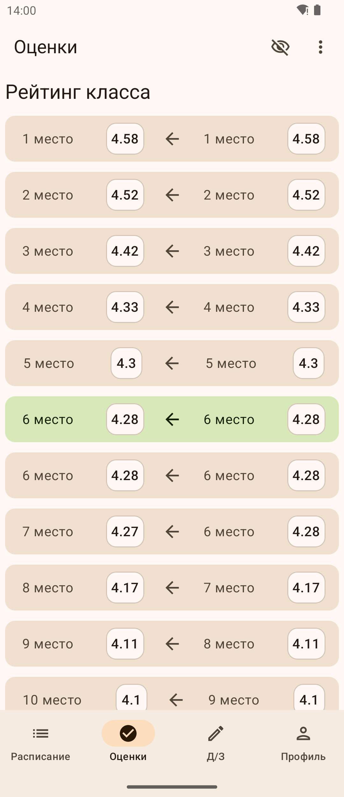
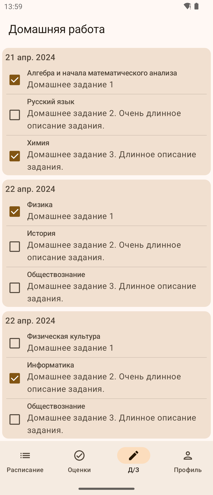
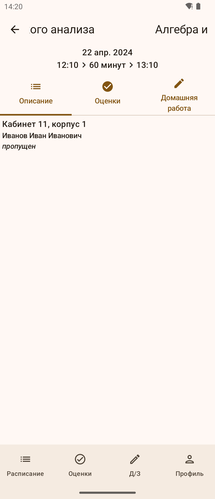
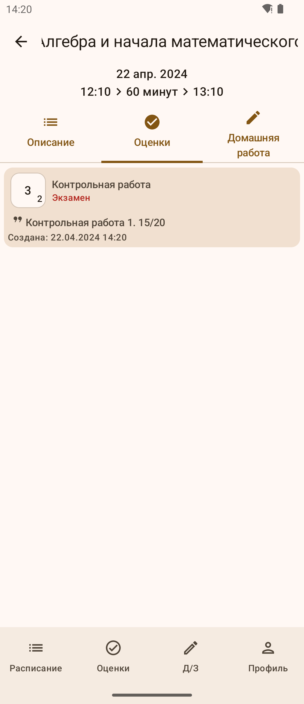

# libremesh
Open source android client for МЭШ (Moscow Electronic School).
 - Native (official app written in React Native), uses Jetpack Compose.
 - Android 8+

> [!warning]
> This app is currently WIP, so there are a lot of flaws, unimplemented features and bugs. If you encounter any, please open an issue

### Screenshots

### Installation
- Download latest pre-built [release](https://github.com/x3lfyn/libremesh/releases/latest)
- Build from source using android studio

### known flaws
- Login occurs through WebView in app. If you have any security concerns, check the source code (it is pretty shitty)
